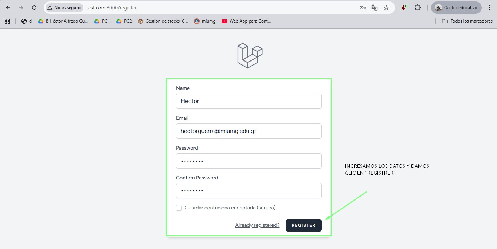
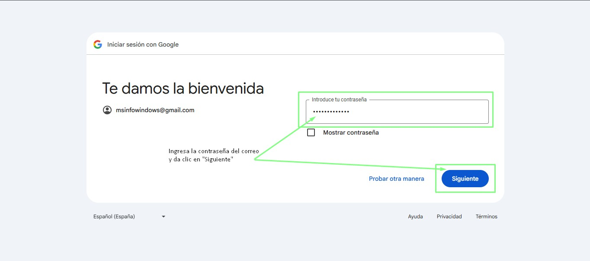

# Sistema de Autenticación con Arquitectura Cliente-Servidor
# Grupo numero 5
# Curso SEGURIDAD Y AUDITORÍA DE SISTEMAS - B
# Docente ING. JOSE LUIS SUCUC OTZOY
## Descripción del Proyecto

Este proyecto tiene como objetivo desarrollar un sistema de autenticación basado en una arquitectura cliente-servidor para la gestión de inventario automotriz. El sistema implementa diferentes métodos de autenticación, incluyendo autenticación básica, autenticación con cifrado de contraseñas y login con Google, permitiendo a los usuarios acceder de forma segura al sistema.

1. **AUTENTICACIÓN BÁSICA** (sin cifrado).
- **Descripción**: El usuario proporciona su nombre de usuario y contraseña en texto plano siguiento los siguientes pasos:

**Paso1** 
**Paso2** 
**Paso3** 

2. **AUTENTICACIÓN CON CIFRADO DE CONTRASEÑAS** (utilizando hash).
- **Descripción**: Las contraseñas se cifran utilizando bcrypt antes de ser almacenadas.
**Paso1** 
**Paso2** 
**Paso3** 

3. **AUTENTECACIÓN CON GOOGLE** (OAuth2).
- **Descripción**: Los usuarios pueden iniciar sesión mediante su cuenta de Google.
**Paso1** 
**Paso2** 
**Paso3** 
**Paso4** 

El sistema también gestiona un **inventario de vehículos**, permitiendo a los usuarios listar vehículos con información como marca, modelo, año, precio, estado, kilometraje y color.

## Métodos de Autenticación Implementados

### 1. Autenticación Básica (Sin Cifrado)
- **Descripción**: El usuario proporciona su nombre de usuario y contraseña en texto plano. Este método no utiliza cifrado, lo que lo hace vulnerable a ataques de interceptación (por ejemplo, sniffing).
- **Uso**: Este método sirve como un ejemplo básico de autenticación, ideal para pruebas de seguridad y aprendizaje sobre la gestión de contraseñas sin cifrado.

### 2. Autenticación con Cifrado de Contraseña
- **Descripción**: Las contraseñas de los usuarios se cifran utilizando algoritmos de **hash** como **bcrypt** o **SHA-256** antes de ser almacenadas en la base de datos. Esto mejora la seguridad, ya que las contraseñas no se almacenan en texto claro.
- **Uso**: Este método asegura que las contraseñas sean irreversibles y difíciles de obtener incluso si la base de datos es comprometida.
- **Algoritmos utilizados**:
  - **bcrypt**: Usado para hash de contraseñas, proporcionando una capa de seguridad adicional frente a ataques de fuerza bruta.
  - **SHA-256**: Alternativa que genera un hash seguro.

### 3. Login con Google (OAuth2)
- **Descripción**: Este método permite a los usuarios autenticarse mediante su cuenta de Google utilizando el protocolo **OAuth2**. Al hacerlo, el sistema obtiene un token de acceso y almacena los datos necesarios para manejar la sesión del usuario.
- **Uso**: Los usuarios pueden iniciar sesión sin necesidad de crear una cuenta manualmente. Este método es útil para una experiencia de usuario más fluida y rápida.
- **Implementación**: Utiliza el paquete **Laravel Socialite** para integrar el login de Google.

## Tecnologías Implementadas

- **Arquitectura**: Cliente-Servidor
- **Protocolo de Comunicación**: HTTP/HTTPS
- **API de Google OAuth2**: Para permitir la autenticación con Google.

## Lenguaje de Programación Utilizado

- **Backend**: **PHP** (utilizando el framework **Laravel**)
- **Frontend**: **HTML**, **CSS**, **JavaScript**
- **Base de Datos**: **MySQL** para el almacenamiento de usuarios e inventarios de vehículos.

## Librerías o Frameworks Empleados

- **Laravel**: Framework PHP utilizado para el desarrollo backend.
- **Laravel Socialite**: Para la integración con servicios externos, como Google, para la autenticación.
- **bcrypt**: Para el cifrado de contraseñas.
- **SHA-256**: Alternativa para hash de contraseñas.
- **Axios**: Para realizar peticiones HTTP en el frontend.
- **TailwindCSS**: Utilizado para estilizar la interfaz de usuario.
- **Laravel Passport**: Para la implementación de autenticación API basada en tokens.

## Sistema de Gestión de Base de Datos

El sistema utiliza **MySQL** para gestionar los datos de usuarios e inventarios de vehículos. Las tablas clave incluyen:

- **Usuarios**: Contiene información como el nombre, correo electrónico y la contraseña cifrada del usuario.
- **Vehículos**: Incluye los detalles de los vehículos disponibles en el inventario, como marca, modelo, año, precio, estado, kilometraje y color.

Las migraciones se gestionan a través de las migraciones de Laravel, lo que facilita la creación y actualización de las tablas.

## Herramientas de Cifrado Utilizadas

- **bcrypt**: Usado para almacenar las contraseñas de forma segura en la base de datos.
- **SHA-256**: Un algoritmo de hash criptográfico utilizado para generar contraseñas seguras (aunque bcrypt es preferido por su capacidad de ajustar la dificultad de hash).
- **Laravel Socialite**: Para gestionar el flujo de autenticación OAuth2 con Google.

## Instalación
Para ejecutar este proyecto en tu máquina local, sigue estos pasos:

1. **Clonar el repositorio**:
   ```bash
   git clone https://github.com/Mario-subuyuc/Automotriz.git

2. **Instalar las dependencias**:
Instala las dependencias de PHP:
composer install

Instala las dependencias de Node.js:
npm install

3. **Configurar el archivo .env**:
## Copia el archivo .env.example a .env y edita las siguientes configuraciones:
## Configura las credenciales de tu base de datos:
DB_CONNECTION=mysql
DB_HOST=127.0.0.1
DB_PORT=3306
DB_DATABASE=automotriz
DB_USERNAME=tu_usuario
DB_PASSWORD=tu_contraseña

## Configura las credenciales de Google OAuth:
GOOGLE_CLIENT_ID=tu_cliente_id
GOOGLE_CLIENT_SECRET=tu_cliente_secreto
GOOGLE_REDIRECT_URI=http://localhost:8000/login/google/callback

## Ejecutar las migraciones:
Ejecuta las migraciones para crear las tablas de la base de datos:
php artisan migrate

## Iniciar el servidor:
Inicia el servidor de desarrollo:
php artisan serve --host test.com
npm run dev

Acceder al sistema:
http://test.com:8000
